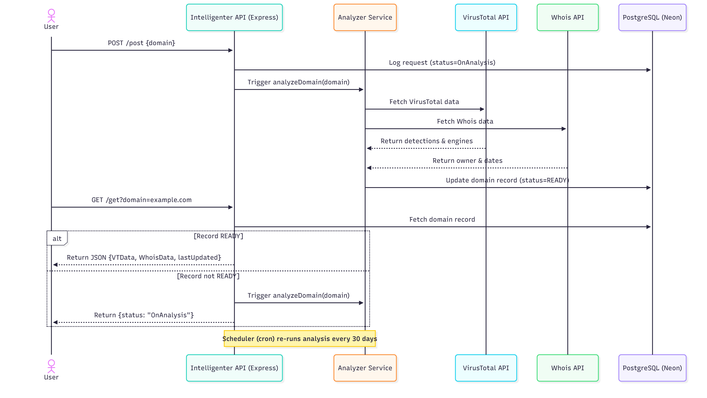

# Intelligenter – Reflectiz Developer Task

A Node.js + TypeScript REST API for domain intelligence analysis.  
The system queries **VirusTotal** and **Whois**, stores results in **PostgreSQL**, and refreshes results automatically with a **scheduler**.

## 🚀 Live Deployment
**The API is currently running live at:**  
**https://reflectiz-developer-task.onrender.com**

You can test all endpoints directly against the live deployment without any local setup.

## ⚡ Quick Start
No setup required! You can use the live endpoint immediately:
Test directly against the live API:

```bash
# Analyze domain
curl -X POST https://reflectiz-developer-task.onrender.com/post \
  -H "Content-Type: application/json" \
  -d '{"domain":"google.com"}'

# Get existing results
curl "https://reflectiz-developer-task.onrender.com/get?domain=google.com"

# Test malicious domain
curl -X POST https://reflectiz-developer-task.onrender.com/post \
  -H "Content-Type: application/json" \
  -d '{"domain":"malware.wicar.org"}'

# Invalid domain
curl -X POST https://reflectiz-developer-task.onrender.com/post \
  -H "Content-Type: application/json" \
  -d '{"domain":"not@valid"}'
```

> ⚠️ **Note:**
> The service runs on a free Render instance, so responses may take a few seconds to return when the server wakes up.
> In addition, you might occasionally receive HTTP `400` or `429` errors — this happens when the free VirusTotal or Whois API keys reach their rate limit or fail to respond for certain domains (e.g., restricted TLDs like `.io`).


## Project Structure
```
intelligenter/
├── src/
│   ├── index.ts           # Express server
│   ├── router.ts          # REST routes
│   ├── services/
│   │   ├── analyzer.ts    # Analysis logic
│   │   ├── virusTotal.ts  # VT integration
│   │   └── whois.ts       # Whois integration
│   ├── scheduler.ts       # Cron job
│   ├── db.ts              # Prisma client
│   └── util/
│       └── validate.ts    # Domain validation
├── prisma/
│   ├── schema.prisma      # DB schema
│   └── migrations/
├── docker-compose.yml
├── render.yaml
└── package.json
```

## System Architecture


## Database Schema

### Domain Table
| Field | Type | Description |
|-------|------|-------------|
| id | UUID | Primary key |
| name | String | Domain name |
| status | String | READY/OnAnalysis/ERROR |
| lastScannedAt | DateTime | Last scan date |
| vtDetections | Int | Detection count |
| vtEngines | Int | Engines scanned |
| whoisOwner | String | Domain owner |
| whoisCreated | DateTime | Creation date |
| whoisExpire | DateTime | Expiration date |

### RequestLog Table
| Field | Type | Description |
|-------|------|-------------|
| id | UUID | Primary key |
| domain | String | Requested domain |
| method | String | HTTP Method |
| status | String | Request result |
| createdAt | DateTime | Log time |

## Installation & Setup (Local)

```bash
# Clone repository
git clone https://github.com/ChaimCymerman0548492309/Reflectiz_Developer_Task
cd Reflectiz_Developer_Task

# Install dependencies
npm install

# Configure environment
cp .env.example .env
# Edit .env with your API keys

# Setup database
npx prisma generate
npx prisma migrate dev --name init

# Run server
npm run dev
```

## API Testing (Live Deployment)

Test directly against the live API:

```bash
# Analyze domain
curl -X POST https://reflectiz-developer-task.onrender.com/post \
  -H "Content-Type: application/json" \
  -d '{"domain":"google.com"}'

# Get existing results
curl "https://reflectiz-developer-task.onrender.com/get?domain=google.com"

# Test malicious domain
curl -X POST https://reflectiz-developer-task.onrender.com/post \
  -H "Content-Type: application/json" \
  -d '{"domain":"malware.wicar.org"}'

# Invalid domain
curl -X POST https://reflectiz-developer-task.onrender.com/post \
  -H "Content-Type: application/json" \
  -d '{"domain":"not@valid"}'
```

## Expected Responses

### Clean Domain
```json
{
  "domain": "google.com",
  "VTData": {"detections": 0, "engines": 95},
  "WhoisData": {
    "owner": "google llc",
    "created": "1997-09-15T07:00:00.000Z",
    "expire": "2028-09-14T04:00:00.000Z"
  },
  "lastUpdated": "2025-10-22T16:01:55.630Z"
}
```

### Malicious Domain
```json
{
  "domain": "malware.wicar.org",
  "VTData": {"detections": 15, "engines": 95},
  "WhoisData": {"owner": null, "created": null, "expire": null},
  "lastUpdated": "2025-10-22T16:01:58.547Z"
}
```

### Invalid Domain
```json
{"error": "invalid domain"}
```

## Features

- **Live Deployment**: Fully functional API available at the provided URL
- **Automatic Scheduling**: Daily cron job to re-scan domains older than 30 days
- **Request Logging**: All GET/POST requests stored in database
- **Caching**: Results stored in PostgreSQL to avoid API rate limits
- **Validation**: Domain format validation before processing


**Tech Stack**: TypeScript, Express, Prisma, PostgreSQL, Node-Cron

**Author**: Chaim Cymerman